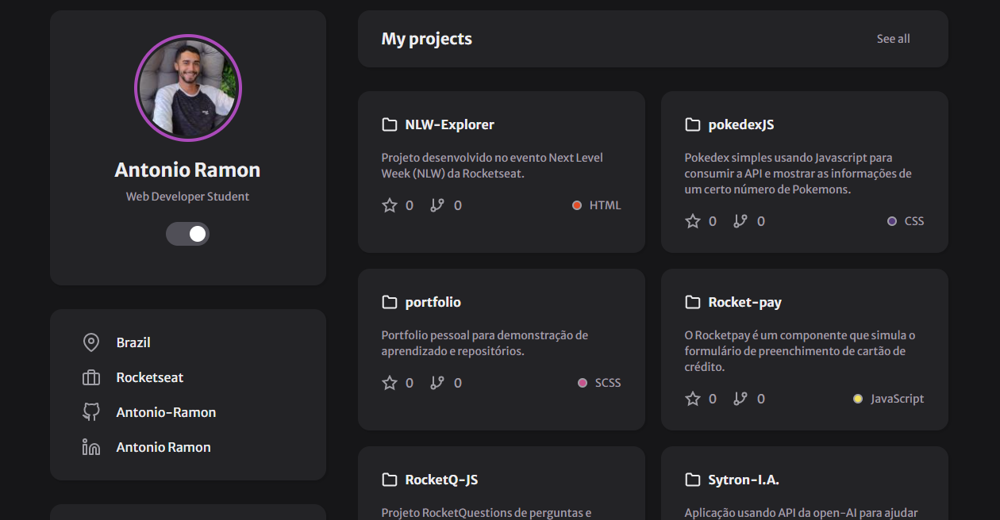

# Meu Portfólio Pessoal

Este é o meu repositório de portfolio pessoal, onde eu apresento todos os meus projetos pessoais e de uso didático,
usando HTML, CSS, Javascript e alimentado com informações da API do Github.

## Demonstração

Veja uma demonstração do meu projeto em: [Link para acessar](https://portfolio-sigma-ten-23.vercel.app/)

## Instalação

Para visualizar os projetos em meu portfolio, basta clonar este repositório e abrir o arquivo `index.html` em seu navegador.

## Exemplos de uso

Os projetos em meu portfolio incluem:

- Um bot usando API da open-ai pra auxiliar os estudos.
- Um site simples mostrando jogos e streamers favoritos
- Um componente que simula o preenchimento e de cartão de crédito
- outros mais...

## Contato

Se você tiver alguma dúvida ou sugestão, sinta-se à vontade para me contatar pelo e-mail: antonio-ramon-dev@outlook.com ou pelo Twitter @Ramon2028.
